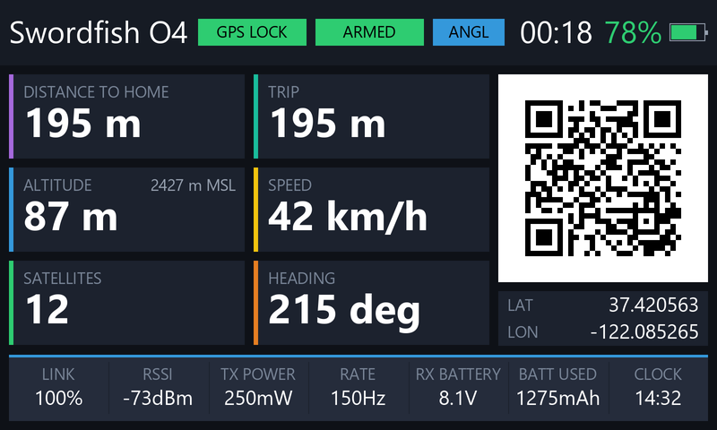

# GPSQR

### A modern UI for modern radios.

Full-screen GPS and ELRS telemetry for EdgeTX color radios, with a scannable Google-Maps QR code of your model's position.



---

Lost a quad in a field? Point your phone at the radio. GPSQR keeps a live, scannable Google-Maps QR of your model's last known position on screen — no cables, no apps, no writing coordinates on your hand.

---

## What it does

**On screen**

- 🛰️ **A QR code that walks you to your model** — scan it with any phone, Google Maps opens at the model's last reported position. It re-encodes as soon as the model moves, and **stays on screen when telemetry dies**, so a crash still leaves you a code to follow.
- 📍 **Distance to home** and **trip flown** — home is captured automatically at take-off, GPS jitter filtered out of the trip.
- ⛰️ **Height above take-off** — with absolute **MSL** alongside on Betaflight and ArduPilot. iNAV does not report sea level at all, so that figure is correctly left out.
- 💨 **Ground speed** and **heading** — heading is computed from the GPS track, so it is correct whatever units your flight controller reports.
- 🛰️ **Satellite count**, color-coded by fix quality.
- ⏱️ **Flight time**, running from the moment you arm until you disarm.
- ✈️ **The flight mode your FC is in**, in its own words — and it turns amber when the model is bringing itself home, red in failsafe.
- 🔋 **Radio battery**, **model battery**, and **milliamp-hours drawn** if your FC has a current sensor.
- 📶 **Full ELRS panel** — link quality, RSSI, TX power, packet rate.
- 📌 **Coordinates**, at the radio's true resolution (~11 cm).
- 🕐 **The radio's clock**, and your **model's name**.

**How it behaves**

- **No per-model configuration, nothing to press.** No buttons, no menus, no reset. It finds its own sensors and reads the arm state from the model. Arm and a fresh flight starts; land and it freezes.
- **An automatic post-flight debrief.** Touch down and the live cards become `MAX DISTANCE TO HOME`, `MAX ALTITUDE` and `MAX SPEED` for the flight you just flew, with the trip and timer held.
- **It never shows you a number it cannot know.** White is live, gray is last-known-with-the-link-down, `--` means never known. Unplug a battery mid-flight and the screen **freezes rather than blanks** — the last position, altitude and heading stay readable in gray, which is exactly when you need them.
- **Everything belongs to the selected model.** Switch models and nothing carries across. No reboot needed.

**Works with**

- **EdgeTX color radios** with an **800×480**, **480×272** or **480×320** screen. [Check yours below](#supported-radios).
- **EdgeTX 2.8 or newer.**
- **CRSF / ELRS** telemetry. Most of the screen degrades gracefully without ELRS.
- **Betaflight, iNAV and ArduPilot**, detected automatically from the flight-mode string, which is also shown on screen. On ArduPilot, turn on **RC_OPTIONS bit 12** ("Annotate flight mode with * on disarm") so the widget can read arm state from the model — see Troubleshooting.
- **Metric or imperial** — one constant you can change yourself at the top of the Lua script.
- A **GPS-equipped model** for the GPS features. Without one, everything else still works and the GPS cards honestly read `--`.

---

## Supported radios

**GPSQR supports three screen sizes, and refuses anything else** — it prints an unsupported-screen notice rather than draw a layout built for a panel you do not have.

| Resolution | Status | Radios |
|---|---|---|
| **800×480** | ✅ **tested** | RadioMaster TX16S **MK3** — the only EdgeTX radio with this panel |
| **480×272** | ✅ **tested** | **TX16S MK1/MK2**, X10, X10 Express, X12S, T16, T18, F16, V16, C14 |
| **480×320** | ⚠️ **untested** | GX15, PL18 / PL18EV / PL18U, ST16, T15, T15 Pro, T22, TX15 |
| 320×480 (portrait) | ❌ not supported | NV14, EL18, NB4P |
| 320×240 | ❌ not supported | PA01 |

**480×320 is accepted but has never been run on hardware.** It has its own layout and deliberately reuses 480×272's fonts, which are the one thing that cannot be known without the radio. If you own one of these, a report either way would be genuinely useful.

---

## Install

1. **Copy the `GPSQR` folder** to the SD card under `WIDGETS/`, so the path is exactly:

   ```
   SD:/WIDGETS/GPSQR/main.lua
   ```

   No reboot needed — it appears in the widget list as soon as the files are on the card.

2. **Add a screen.** From the home view, short-press the `[TELE]` key to open the screens editor, then select `+` at the top of the screen to add a new widget screen.

3. **Set that screen with a full-screen layout and all toggles OFF:**

   | Setting | Value |
   |---|---|
   | **Layout** | the **single full-screen zone** (one empty rectangle) |
   | **Top bar** | **OFF** |
   | **Flight mode** | **OFF** |
   | **Sliders** | **OFF** |
   | **Trims** | **OFF** |

   Then **Setup widgets** → select the zone → choose **GPSQR**.

   > **If you see `GPSQR — needs a FULL-SCREEN zone`** and a checklist, the zone is too small: one of the toggles above is still on, or the layout has more than one zone. The widget checks the zone it is actually handed, not the radio's resolution — a zone can be full width and still far too short. On an 800×480 radio it needs about 443 px of height.

   > **If you see `GPSQR — unsupported screen size`**, your radio's panel is not one of the three in the table above, and no Screens setting will change that.

4. **Rebuild the sensor list.** Go to **Model → Telemetry** and use **Delete all**. Then run **Discover new** sensors with the model powered on and the link up, leaving it a few seconds so the slower frames (e.g. GPS) are seen too. Once they are all listed, **reboot the radio**.

   > **The reboot matters.** A sensor keeps its last received value until the radio restarts, and re-discovering rebuilds the *list* without clearing those values. A leftover sensor can go on reporting a stale number on a model that has no such hardware — seen on a GPS-less model reporting 1–2 satellites until it was power-cycled. **Power-cycle after any sensor surgery.**

---

## Reading the screen

### The GPS pill

| Pill | Meaning |
|---|---|
| **`NO GPS`** red | this model has **no GPS sensor** — nothing is coming |
| **`NO FIX`** red | a GPS is fitted but has no usable position yet |
| **`ACQUIRING`** amber | coordinates, but fewer than 6 satellites |
| **`GPS LOCK`** green | 6 satellites or more — QR and `LAT`/`LON` published |

The QR and the coordinates appear at `GPS LOCK` only. A one-satellite fix can be kilometers out, and a code that walks you to the wrong field is worse than no code. Once a code exists it stays on screen even if the count later dips.

### The arm pill

Read from the flight controller itself. Amber always means **"don't take off yet"** — and the *word* tells you whose objection it is:

| Pill | Meaning | What to do |
|---|---|---|
| **`DISARMED`** gray | disarmed, ready to arm | fly |
| **`DISARMED`** amber | **the widget's warning**: no `GPS LOCK` yet | **wait** |
| **`BLOCKED`** amber | **the flight controller is refusing to arm** | **fix it** |
| **`ARMED`** green | armed, all well | — |
| **`ARMED`** amber | armed **and in failsafe** | — |

- **`DISARMED` amber is about your telemetry, not the FC.** Home is captured at take-off and needs a lock, so arming before then costs you the home point — and with it `DISTANCE TO HOME` and height above take-off. A model with no GPS never shows this warning, so it will not sit amber forever.
- **`BLOCKED` is the model talking** — the FC reports arming disabled. Usually throttle not at idle, model not level, calibration pending, or an arming switch already on. It clears the moment the FC is happy. Only ever shown on the ground.
- **If telemetry is lost the pill holds its last state** rather than claiming `DISARMED`. A lost link means *unknown*, and the model may well still be flying.

### The mode pill

The third pill is the flight controller's own flight-mode string, shown **exactly as the FC sends it** — no translation, no renaming. Only the arming marker is taken off, because the arm pill has already used it. It appears on any model that has an `FM` sensor, whatever the firmware.

| Pill | Meaning |
|---|---|
| **`!FS!`** red | the FC has declared **failsafe** |
| **`!ERR`** amber | the FC **refuses to arm** (iNAV and Betaflight 4.3/4.4 say this in the mode string; Betaflight 5.x says it with the marker instead, so there you see `BLOCKED` beside a normal mode) |
| **`RTH` `RTL` `SRTL` `QRTL` `WRTH`** amber | **the model is flying itself home** — you may not have asked it to |
| anything else, blue | the mode you selected. `ACRO`, `ANGL`, `AUTO`, `LOIT`, `QHOV`, `CRUZ`… |
| anything else, gray | the same, but the link is down, so it is the last mode you saw |

- **Blue is not a judgment.** Green on this screen means *a good thing is true* — `GPS LOCK`, `ARMED`. A flight mode is neither good nor bad, so the mode pill sits off that scale while it is only reporting. When it does turn amber or red, that is the signal.
- **`WAIT` is blue, not amber.** Betaflight sends it when there is no fix *or* no home point yet, and the home point is only set when you arm — so it is normal on the ground and clears on its own. Your GPS pill is the honest answer to "can I fly yet".
- **On a dropout only blue turns gray.** Amber and red keep their color: if the last thing the model said was `!FS!`, hiding it is the last thing you want.
- **ArduPilot gets the most out of this pill**, because its 50-odd modes are otherwise invisible from the radio.

### What each card shows, and when

Nothing is displayed until it means something:

| | Below `GPS LOCK` | On the ground | Armed | **Landed** |
|---|---|---|---|---|
| distance | `--` | `0 m` | live | **`MAX DISTANCE TO HOME`** |
| trip | `--` | `0 m` | live | **held** — that flight's total |
| altitude | `--` | `0 m` + live MSL | live + MSL | **`MAX ALTITUDE`** + that flight's highest MSL |
| speed | `--` | `0 km/h` | live | **`MAX SPEED`** |
| heading | `--` | `--` | live | `--` (a bearing means nothing parked) |
| `LAT` / `LON` | `--` | shown | shown | shown |
| satellites | the count | the count | the count | the count |

The satellite count is never blanked — it is the number you watch while waiting for a lock. Speed and heading read as "at rest" while disarmed, because a parked model's GPS still reports a meter or two of noise.

**Home is captured at take-off** and stays fixed for that flight. Arming again re-homes at the new spot, so you can move launch point without a power cycle.

### Altitude

The big number is **height above the launch point**; the small figure on the label row is absolute **MSL**:

```
ALTITUDE          2427 m MSL
87 m
```

MSL is live from `GPS LOCK` onwards, on the ground included, so you can read your field elevation before launching. The big number only means something once flying, so it reads `0` until you arm.

> **On iNAV there is no MSL figure, and that is correct.** iNAV reports height above its launch origin, not sea level — which is why an iNAV model reads `0 m` on the ground however high the field is. Sea level is simply not in iNAV's telemetry, so the line is dropped rather than filled with a height wearing the wrong label. The big number is unaffected.

> **MSL reads tens of meters off, consistently?** That is the **geoid**, not a fault. A GPS computes height above a smooth mathematical ellipsoid; mean sea level follows the lumpy geoid, and the two differ by −105 m to +85 m depending where you are. Fix it with `MSL_OFFSET`: stand somewhere whose elevation you know, read the MSL line, and set it to `true − shown`. One value covers your whole region, and it touches the MSL line only.

### Stale data is grayed out

**White = live. Gray = the last known value, the link is down.** Nothing is ever invented or falsely zeroed.

| | On telemetry loss |
|---|---|
| distance, altitude, speed, heading, satellites, trip, `LAT`/`LON` | **grayed** — frozen at the last reading |
| `RSSI`, `TX POWER`, `RATE`, `RX BATTERY` | **grayed** — they only ever arrive inside the telemetry frame |
| **QR code** | unchanged — still encodes that last position, which is what you walk to |
| `LINK` | **stays white** — `0%` is itself the live answer, a true reading of a dead link |
| flight timer | **keeps running** — it depends only on arm state |
| radio battery, clock | **unaffected** — neither comes from the model |
| arm pill | **holds** — a lost link means unknown |
| mode pill | **holds**, and grays — unless it is amber or red, which keep their color |
| `MAX …` cards | **stay white** — a finished flight's record is history, not a stale reading |

Staleness is judged from the link statistics alone. If your setup has no link sensors, nothing is ever grayed: the widget will not claim staleness it cannot detect.

---

## Settings

All settings are constants in the `CFG` table at the top of `WIDGETS/GPSQR/main.lua`. There are no on-screen controls: EdgeTX only delivers input to a widget in full-screen mode, so any control would be invisible to anyone running it as a plain telemetry page.

The ones worth knowing about:

| Key | Default | Meaning |
|---|---|---|
| `UNITS` | `"metric"` | `"metric"` (m, km, km/h) or `"imperial"` (ft, mi, mph) |
| `MSL_OFFSET` | `0` | meters added to the **MSL line only** — your local geoid correction |
| `MIN_SATS` | `6` | satellites required for `GPS LOCK` and a home capture |
| `QR_URL` | Google Maps | the map link the QR encodes — a `geo:` URI also works. Keep the whole URL under 53 bytes |
| `ARM_MODE` | `"auto"` | `"auto"` reads the FC; or name the switch that arms your model, e.g. `"sf"` |
| `SPEED_TO_KMH` | `1.0` | scale the speed sensor. FrSky GPS often reports **knots** → `1.852` |
| `ALT_TO_M` | `1.0` | scale the altitude sensor (a feet sensor → `0.3048`) |
| `TRIP_MIN_STEP` | `3.0` | meters; movement smaller than this is GPS jitter, not travel |
| `QR_MIN_MOVE` | `3.0` | meters the model must move before the QR is re-encoded — the same jitter floor, so a parked model never rebuilds |

The remaining constants encode a **measurement** rather than a preference — `ALT_JUMP_M`, `TRIP_MAX_STEP`, `QR_SLICE`, the QR precision. The comments beside them say what was measured; don't retune them without redoing it.

Sensors are looked up by name — `Sats`, `GAlt`, `Alt`, `GSpd`, `GPS`, `Capa`, `FM`, and the ELRS set (`1RSS`, `2RSS`, `RQly`, `TPWR`, `RFMD`, `RxBt`). If your telemetry uses different names, edit the `*_SENSORS` lists near the top of the file; each is tried in order and the first that exists is used.

> **`GAlt` only exists on EdgeTX 2.12 and newer.** On 2.8–2.11 the CRSF GPS altitude is discovered as `Alt` instead — same measurement, different label. The widget handles both, and on the older name it just has to see one arming before the MSL figure appears. **Sensor names are stored in the model**, so a model set up under older firmware keeps the old name after you upgrade; use **Delete all** and re-discover if you are on 2.12+ and have no `GAlt`.

---

## Troubleshooting

- **Fields stay blank though telemetry clearly works** — rebuild the sensor list: **Delete all**, re-discover, reboot ([step 4](#install)). A list that has accumulated over several receivers can hold entries with the right name but the wrong ID.
- **No MSL figure** — the altitude sensor is missing: `GAlt` on EdgeTX 2.12+, or `Alt` on 2.8–2.11. Same measurement, different name. It rides the same frame as `GPS`, `GSpd`, `Hdg` and `Sats`, so if you have those four the data is already arriving; re-discover with a fix acquired. On iNAV there is correctly no MSL at all.
- **Trip creeps up while the model sits still** — raise `TRIP_MIN_STEP`. It has to exceed your receiver's worst jitter. Parked for 60 s with ±2 m of wander, a 2 m floor invents **641 m** of trip while a 3 m floor reads **0 m**. Raising it costs nothing in accuracy, so err high.
- **ELRS cells read `--`** — those sensor names aren't present. Normal on non-ELRS setups, and it doesn't affect the GPS features.
- **`TX POWER` and `RATE` read `--` with the model switched off** — the radio has genuinely never been told them. Both ride in the CRSF link-statistics frame, and EdgeTX drops the later sub-fields when link quality is zero. It fixes itself the moment the model is powered up.
- **Home never locks** — home is set when the model **arms**, and needs `GPS LOCK` at that moment. Without it the capture waits for the first locked frame.
- **`RATE` shows `#<number>`** — an ELRS packet rate not in the lookup table. Open an issue with the value and the real rate and it can be added.
- **On ArduPilot the arm pill never leaves `DISARMED`, or only changes once you fly** — ArduPilot does not put arm state in its flight-mode string unless you ask it to. In Mission Planner set **RC_OPTIONS bit 12**, *"Annotate flight mode with * on disarm"*. Without it the widget will not guess: it falls back to a radio switch (`ARM_MODE`) or to motion, because home, the trip and the timer all key off the arm moment and inventing one is worse than admitting there is no source.

---

## Credits

GPSQR is a project by **Joël Conus** — the design, the requirements, and the field work behind them. Every behavior here was specified against real flying: each iteration was flown, the radio screenshots that the layout, font metrics and telemetry handling are calibrated against came off the author's own two radios, and every design rule at the top of `main.lua` was paid for by something going wrong in a field.

The **code** was written by **Claude** ([Anthropic](https://www.anthropic.com)) — the widget and this documentation.

Where the firmware's behavior mattered, it was read rather than guessed: the widget's own comments cite the EdgeTX, Betaflight, iNAV and ArduPilot source each rule was derived from.

ArduPilot support was contributed by **Keith Luneau**.

## License

MIT — see [LICENSE](LICENSE).

---

## Tags

**Radios** — RadioMaster TX16S, GX15, TX16S MK2, TX16S MK3, Jumper T16, T18, T15, T22, TX15, FrSky X10, X10 Express, X12S, Horus, Flysky PL18, PL18EV, PL18U, ST16, F16, V16, C14 · 800×480, 480×272, 480×320 color LCD

**Firmware & link** — EdgeTX, EdgeTX widget, color-radio widget, Lua widget, Lua 5.3, CRSF, ELRS, ExpressLRS, Betaflight, iNAV, ArduPilot, ArduCopter, ArduPlane, flight controller telemetry

**What it does** — GPS telemetry, QR code, Google Maps QR, lost model locator, lost drone finder, find my drone, distance to home, trip distance, altitude MSL, ground speed, course over ground, satellite count, flight timer, mAh consumed, flight mode display, link quality, RSSI, TX power, packet rate, full-screen telemetry screen

**Aircraft** — FPV, drone, quadcopter, quad, multirotor, RC plane, fixed wing, model aircraft, long range

**British spellings** — colour radio, colour LCD, colour-radio widget, EdgeTX colour screen, metres, kilometres, greyed out. The project is written in US English; these are here so a search in either spelling finds it.
